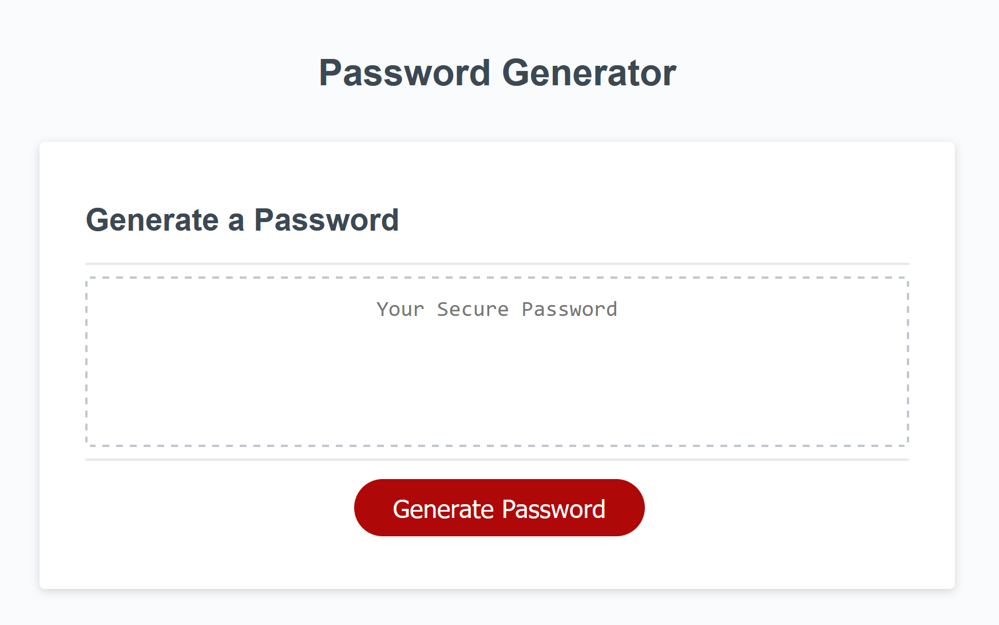

# Boot Camp - Module 3 Challenge - JavaScript Challenge: Password Generator

## About

A JavaScript coding challenge for UConn Boot Camp.

## Description

This project invloved taking starter code (HTML, CSS, and JavaScript) and updating the JavaScript code to fit a variety of acceptance criteria. Some of the acceptance criteria included prompting the user for the length of the desired password, prompting the user for the types of characters they would like to include in the password (e.g., lowercase letters, uppercase letters, numbers, special characters), and displaying the randomly generated password on the screen for the user.

The main challenge I encountered while completing this project was determining how to start writing my code given my beginner knowledge of JavaScript. The first thing I did was to write out as much pseudo code as I could in order to break down the project into manageable pieces. Then, after some research, I began writing my code, first by creating an array from which to generate the password.

I then worked on developing and writing the prompts the user would need to answer to generate the password. From there, I merged the arrays chosen by the user with the concat method. This resulted in an array that contained all of the data from the user's chosen arrays. I realized that I needed to take the user's desired password length and somehow apply it to this array. I ended up creating a loop that takes the array of the user's choices and loops over it and produces a new array of the user's desired length.

I then took time to address any instances of the user inputing information into the prompts that did not work within the parameters of the project (e.g., the password needs to be between 8 and 128 characters long). This was the part that was the hardest for me. Whenever the user inputs an incorrect number or character, I made it so that they receive a message regarding their mistake; however, after that, I had some trouble getting the user back to the beginning state of the project. Thus, for now, I forced the page to reload so that the user can try again.

- Per feedback from the Boot Camp grading team, I deleted the reload method and added in a return. I figured out on my own that to make the placeholder text say "Your Secure Password" instead of undefined, I simply had to change the textarea as shown below.

```
// location.reload();
textarea.placeholder = "Your Secure Password";
return;

```

One thing I spent some time researching that I enjoyed doing for this project was creating a reuseable function that can get a random value from an array:

```

function getRandomValue(array) {
const randomValue = array[Math.floor(Math.random() * array.length)];
return randomValue;
}

```

## Technologies

HTML, CSS, JavaScript, Git, GitHub, VS Code, Chrome, Firefox

## Screenshot



## Deployment

[GitHub Pages](https://kkarrwrites.github.io/boot-camp-module-03-challenge-javascript-password-generator/)

## License

This project is licensed under the MIT License.

## Resources

### JavaScript

#### Arrays

- [Array.prototype.concat()](https://developer.mozilla.org/en-US/docs/Web/JavaScript/Reference/Global_Objects/Array/concat) on MDN
- [Array.prototype.join()](https://developer.mozilla.org/en-US/docs/Web/JavaScript/Reference/Global_Objects/Array/join) on MDN
- [Array.prototype.push()](https://developer.mozilla.org/en-US/docs/Web/JavaScript/Reference/Global_Objects/Array/push) on MDN
- [Get a random Element from an Array using JavaScript](https://bobbyhadz.com/blog/javascript-get-random-element-from-array) by Borislav Hadzhiev
- [How to Get a Random Value From an Array in JavaScript](https://medium.com/programming-essentials/how-to-get-a-random-value-from-an-array-e6c6958403df) by Cristian Salcescu

#### Loops

- [The For Loop](https://www.w3schools.com/js/js_loop_for.asp) on W3Schools

#### Methods

- [isNaN()](https://developer.mozilla.org/en-US/docs/Web/JavaScript/Reference/Global_Objects/isNaN) on MDN

#### Prompts

- [The JavaScript prompt – Getting user input](https://www.webdevelopersnotes.com/the-javascript-prompt-getting-user-input) on Web Developer Notes

#### Scripts

- [Scripts: async, defer](https://javascript.info/script-async-defer) on JavaScript.info

#### Strict Mode

- [The modern mode, "use strict"](https://javascript.info/strict-mode) on JavaScript.info

#### Strings

- [Check if String contains only Digits](https://bobbyhadz.com/blog/javascript-check-if-string-contains-only-digits) by Borislav Hadzhiev

#### Variables

- [Var, Let, and Const – What's the Difference?](https://www.freecodecamp.org/news/var-let-and-const-whats-the-difference/) by Sarah Chima Atuonwu on freeCodeCamp
